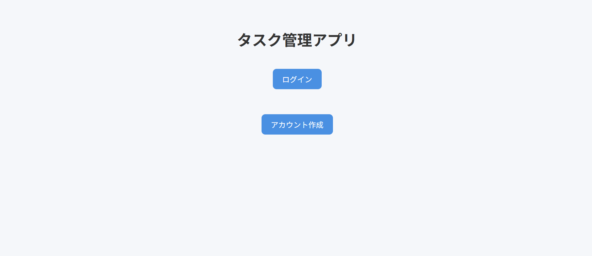
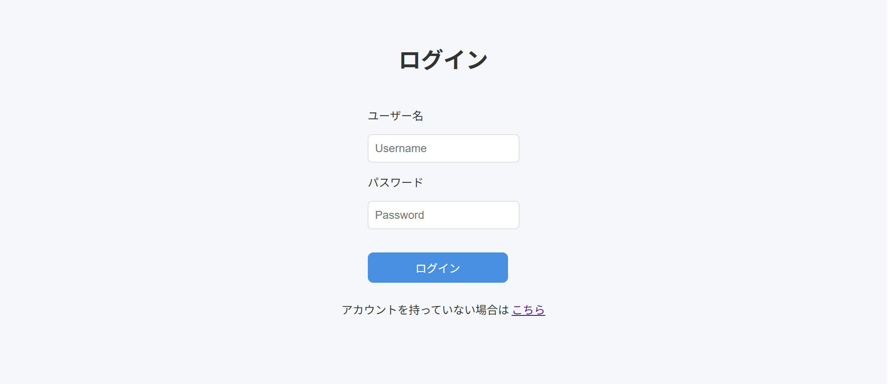
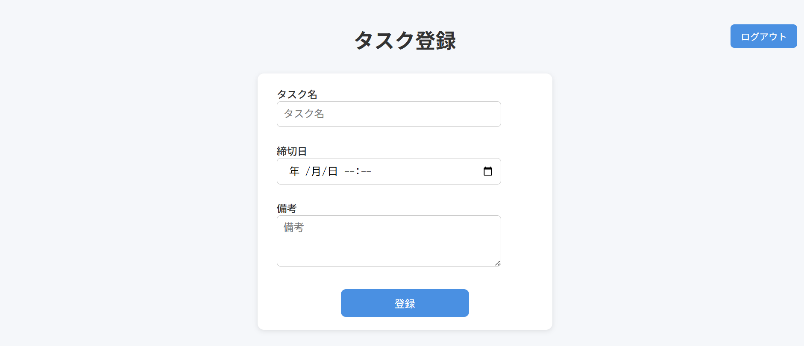
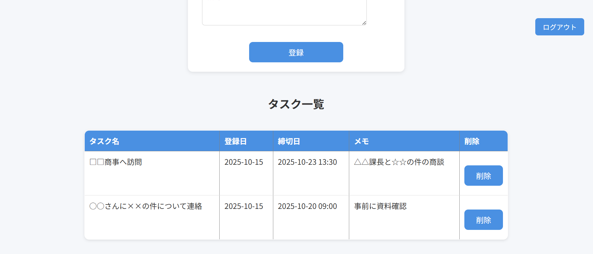
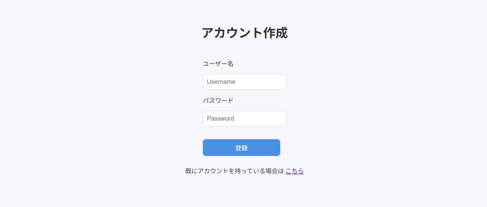

# タスク管理アプリ (ToDo Management App)

このアプリは **ユーザーごとにタスクを登録・管理できる ToDo アプリケーション** です。  
ログイン機能を備えており、ユーザーごとにタスクボードが表示され、タスクを登録・削除することができます。

---

## 開発の目的

効率的にタスクを管理したいと考え、自分が日常的に使いやすいタスク管理アプリを作成しました。  
Docker環境を構築し、Laravelを用いて開発を進めることで、データベース設計や認証機能の仕組みを理解すると同時に、  
実務に近い開発プロセスを体験することを目的としました。

## 学んだこと・得られたスキル
- Laravelを用いたMVCアーキテクチャの理解  
- 認証機能（ログイン／ログアウト）の実装方法  
- リレーション（1対多）を用いたDB設計  
- Dockerを用いた開発環境の構築  
- GitHubによるバージョン管理とリモートリポジトリ運用

## 工夫した点

1. **ユーザーごとのタスク管理**  
   タスクを`user_id` と紐付け、ログイン中のユーザーだけが自分のタスクを操作できるように設計しました。  
   認証機能と画面表示を組み合わせ、他ユーザーのタスクにアクセスできない仕組みを実現しています。

2. **データベース設計の効率化**  
   TaskとUserのリレーションを1対多で設計し、今後タグ機能を追加しても柔軟に対応できるようにしました。  
   登録日や締め切り日を明確に管理し、締め切り日までのカウントダウン機能などの拡張も容易になるようにしています。

3. **Dockerによる開発環境の統一**  
   Laravel・PHP・MySQLをDockerでコンテナ化し、環境差異による不具合を防止しました。  

4. **保守性・拡張性を意識したコード設計**  
   MVCアーキテクチャに沿ったコントローラー・モデルの設計で、コードの保守性ならびに拡張性を高めました。  

5. **UI・UXの工夫**  
   タスク一覧画面ではテーブル表示で締め切り日や備考を見やすく整理しました。  
   ユーザーが直感的に操作できるように画面構成をシンプルにしています。

## 概要
- ユーザー登録・ログイン機能  
- タスクの登録・削除・一覧表示  
- 各ユーザーが自分のタスクのみを管理可能  

---

## 画面イメージ（ScreenShot）

   
  トップ画面

 

   
  ログイン画面

 

   
  タスクボード画面（1枚目）

 

   
  タスクボード画面（2枚目）

 

   
  ユーザー登録画面

 
## データベース構成

###  User テーブル
- id: 主キー (自動採番) 
- username: ユーザー名（ユニーク）
- password: パスワード（ハッシュ化） 
- registered_at: 登録日時 
- remember_token: ログイン保持トークン 
- created_at / updated_at: タイムスタンプ

###  Task テーブル
- id: タスクを一意に識別するID
- user_id: 所有ユーザーのID | 外部キー（users.id） 
- title: タスク名
- registered_at: タスクの登録日時
- due_date: タスクの締切日時
- memo: タスクの詳細・補足メモ
- created_at / updated_at: タイムスタンプ

## 今後のアップデート予定
- **タグ機能の追加**：タスクごとにタグを付与し、分類・検索できるようにする  
- **カウントダウン機能**：締め切り日から現在時刻を減算することにより、残り時間を表示できるようにする  

---

## 使用技術
- **バックエンド**：Laravel (PHP)  
- **フロントエンド**：HTML / CSS / JavaScript  
- **データベース**：MySQL  
- **環境**： Docker
- **使用OS**： Windows

---

## 今後の方針
今後はタグ機能とカウントダウン機能の実装を進めながら、  
UIの改善やユーザー体験の向上を図っていきます。

---
